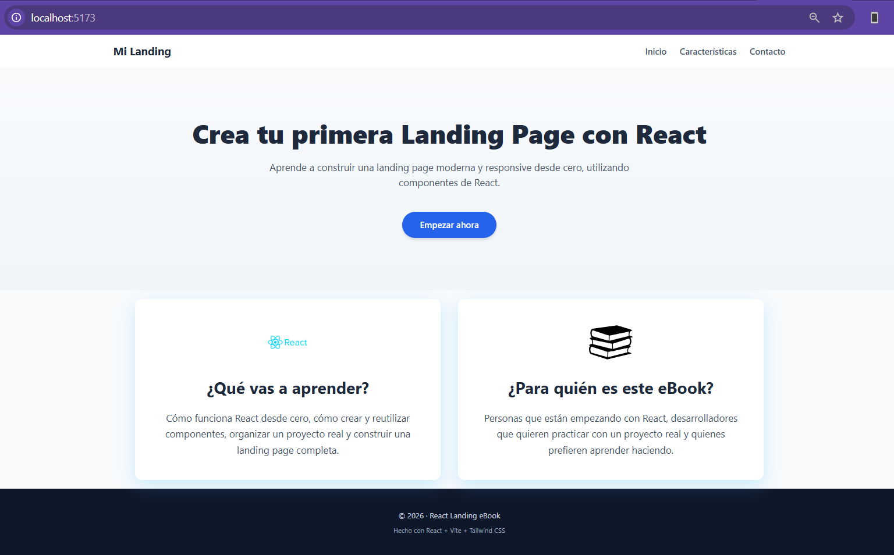
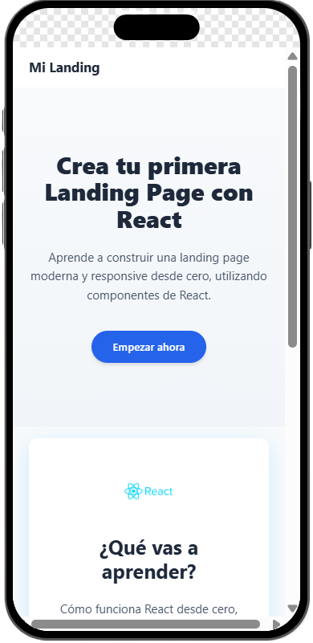
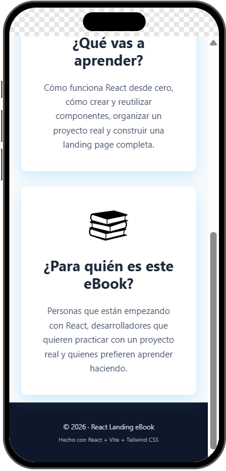

 
    

# 🚀 Landing Page Básica
Este proyecto consiste en una landing page básica desarrollada como práctica de maquetación y estructura web. La idea es simple y clásica (porque lo que funciona, funciona): una página clara, directa y enfocada en comunicar un mensaje principal.

 
    
    
    

La landing incluye las secciones esenciales:
- Header con navegación
- Sección principal (hero) con llamado a la acción
- Sección informativa sobre el producto/servicio
- Footer con información adicional

El objetivo del proyecto es:
- Practicar estructura HTML semántica
- Aplicar estilos con CSS de forma ordenada
- Sentar una base sólida para futuros proyectos más complejos

No hay magia negra ni frameworks raros: **estructura bien hecha, código limpio y fácil de escalar**. Ideal como punto de partida para agregar interactividad, animaciones o conectar con un backend más adelante.

> 📌 Proyecto pensado para aprendizaje y demostración de conceptos básicos de desarrollo frontend.
